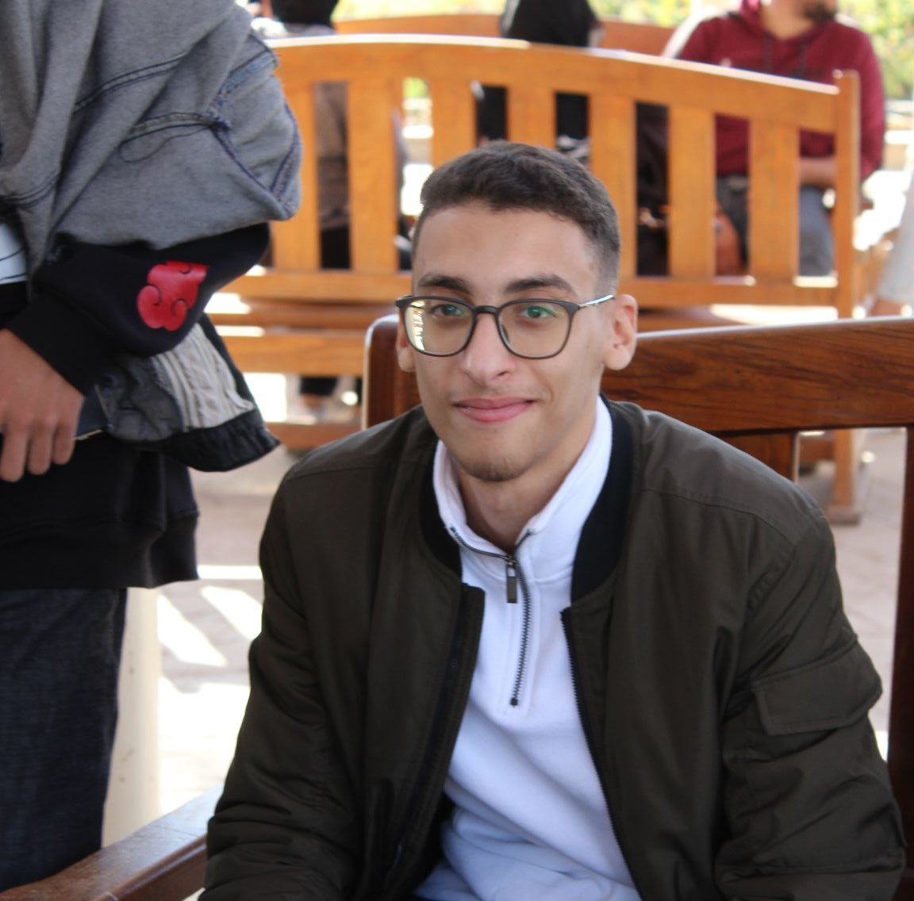

<!DOCTYPE html>
<html lang="en">
<head>
  <meta charset="UTF-8">
  <meta name="viewport" content="width=device-width, initial-scale=1.0">
  <title>Fares Emad | Portfolio</title>
  
</head>
<body>
  <header>
    <!-- Replace with your own photo -->
    
    <h1>&lt;Fares Emad /&gt;</h1>
    
Data Scientist

  </header>

  <nav>
    <a href="#about">About</a>
    <a href="#projects">Projects</a>
    <a href="#contact">Contact</a>
  </nav>

  <section id="about">
  <h2>About Me</h2>
  

    Hello! I’m Fares Emad, a passionate learner and aspiring <strong>Data Scientist</strong>.  
    My journey into data science began when I discovered how data could uncover hidden patterns and help solve real-world problems.  
  

  

    I started exploring tools like <strong>Python, SQL, and Power BI</strong>, and soon realized that data science is more than just numbers —  
    it’s about <em>telling stories with data</em>, making informed decisions, and building solutions that create impact.  
  

  

    I’m especially fascinated by how data science connects different fields — from healthcare and education to business and technology.  
    My passion is to keep learning, experimenting, and turning raw data into meaningful insights.  
  

  

    Outside of coding and analytics, I enjoy continuous self-learning, teamwork,  
    and sharing knowledge with others. My ultimate goal is to use data to solve problems that truly matter.  
  

</section>

  <section id="projects">
    <h2>Projects</h2>
    

      

        <h3>🏥 Hospital Data Project</h3>
        
Built a system to analyze hospital records and improve efficiency.

      

      

        <h3>📊 Sales Dashboard</h3>
        
Created a Power BI dashboard to visualize sales trends & seasonality.

      

      

        <h3>🎓 Student Performance Prediction</h3>
        
Used ML to predict student scores from study hours with Python.

      

    

  </section>

  <section id="contact">
    <h2>Contact Me</h2>
    

      <a class="btn btn-email" href="mailto:fares.emad.abdelnaby@gmail.com">📧 Email</a>
      <a class="btn btn-linkedin" href="https://www.linkedin.com/in/faresemad4106/" target="_blank">💼 LinkedIn</a>
      <a class="btn btn-github" href="https://github.com/FaressEmad" target="_blank">🐱 GitHub</a>
    

  </section>

  <footer>
    
© 2025 &lt;Fares Emad /&gt;. All rights reserved.

  </footer>
</body>
</html>
